# 光衡随身终端

> 基于 ESP32-S3 的可携带家庭能源交互终端  
> 随时查看家庭能源、接收智能建议、语音控制设备，并确认执行结果。


---

## 项目简介

光衡随身终端是光衡家庭能源系统的便携式交互入口，硬件基于：

- **MCU：ESP32-S3**
- **开发板：Waveshare ESP32-S3-Touch-AMOLED-1.8**
- **固件框架：ESP-IDF 5.5.5**
- **显示框架：LVGL**
- **生产服务器：`https://43.155.204.194`**

它不是一个独立运行的“遥控器”，也不会绕过系统直接控制 Home Assistant。

光衡随身终端与 Flutter App 连接同一个 GuangHeng Backend，共享家庭能源状态、设备权限、智能建议、Action Set、执行进度和 Smart Meter 验证结果。

用户可以随身携带终端，在不打开手机 App 的情况下：

- 查看家庭能源状态；
- 接收光衡主动发现的能源机会；
- 使用语音查询或调整家庭能源；
- 查看跨设备协同方案；
- 通过长按确认授权执行；
- 查看设备回读和 Smart Meter 最终验证结果。

---

## 它解决什么问题

家庭能源设备越来越多，但用户通常需要：

1. 打开手机；
2. 找到对应 App；
3. 进入设备页面；
4. 理解储能和用电参数；
5. 修改设备设置；
6. 再返回其他页面确认结果。

光衡随身终端把这个过程缩短为：

```text
抬手查看
    ↓
收到能源建议
    ↓
语音表达需求或查看方案
    ↓
必要时长按确认
    ↓
查看执行与验证结果
```

它让家庭能源管理从“必须打开 App 操作”，变成随时可以查看、询问、确认和验证的自然交互。

---

## 系统架构

```mermaid
flowchart TD
    USER[用户] --> COMPANION[光衡随身终端<br/>ESP32-S3]
    USER --> APP[光衡 Flutter App]

    COMPANION -->|HTTPS| BACKEND[GuangHeng Backend]
    APP -->|HTTPS| BACKEND

    COMPANION -->|语音 PCM/WAV| VOICE[语音服务]
    VOICE --> ASR[Faster Whisper ASR]
    ASR --> HERMES[Hermes AI]

    HERMES -->|理解、解释、意图| BACKEND
    BACKEND --> OPTIMIZER[确定性能源优化]
    BACKEND --> SAFETY[权限与安全检查]
    BACKEND --> HA[Home Assistant]

    HA --> STORAGE[Anker SOLIX 储能]
    HA --> PLUG[Smart Plug Gen 2]
    HA --> METER[Smart Meter Gen 2]

    STORAGE -->|状态回读| HA
    PLUG -->|状态回读| HA
    METER -->|家庭结果验证| HA

    HA --> BACKEND
    BACKEND -->|执行与验证结果| COMPANION
    BACKEND -->|执行与验证结果| APP
```



### 职责边界

| 组件 | 主要职责 |
|---|---|
| 光衡随身终端 | 即时查看、语音交互、方案展示、长按确认、结果展示 |
| 光衡 Flutter App | 深度管理、策略配置、设备管理、权限设置和历史报表 |
| GuangHeng Backend | 能源状态、权限、安全检查、Action Set、执行和验证 |
| Hermes AI | 理解用户需求、解释原因、回答问题和识别意图 |
| 确定性优化器 | 计算具体数值、设备动作、边界和约束 |
| Home Assistant | 设备接入、状态读取和服务调用 |
| Smart Meter | 提供家庭电网侧结果证据，验证目标是否真正实现 |

光衡随身终端不会保存 Home Assistant Token、AI 服务密钥、SOLIX 凭据或服务器管理密钥。

---

## 核心功能

### 1. 家庭能源随身查看

终端从生产 Backend 获取真实服务器状态，并显示：

- 光伏功率；
- 家庭负载；
- 电网购电或反送；
- 储能电量；
- 终端电池状态；
- 当前连接状态；
- 数据是否过期；
- 最近一次成功同步时间；
- 数据来源模式。

如果当前数据来自比赛使用的 TCP Simulator，屏幕会明确显示：

```text
模拟环境
```

不会把模拟数据伪装成真实家庭数据。

网络中断后，终端会保留最后一次成功数据，但明确标记为“已过期”，避免用户把历史状态误认为实时状态。

---

### 2. 可携带的能源通知入口

当光衡发现值得用户关注的能源机会时，终端可以显示待处理方案，例如：

- 当前存在明显光伏余电；
- 建议提高储能充电功率；
- 建议调整备电比例；
- 建议暂时关闭非关键负载；
- 天气变化后建议提前保留电量；
- 家庭负载接近设定峰值；
- 多台设备需要协同执行。

用户不需要持续查看 Dashboard。没有必要动作时，终端保持安静；真正需要决定时，才展示方案。

---

### 3. 光衡语音控制

用户可以直接对终端说：

```text
“我现在家里的能源情况怎么样？”
“直接把备电改成 20%。”
“今晚多留一点电。”
“现在光伏有多余，把电池充起来。”
“停止热水器，优先给电池充电。”
“明天下雨，帮我提前准备。”
```

语音链路为：

```text
板载麦克风
    ↓
ES8311
    ↓
I2S
    ↓
ESP32-S3 PCM Buffer
    ↓
Production HTTPS
    ↓
Faster Whisper ASR
    ↓
Hermes 意图理解
    ↓
GuangHeng Backend
```

终端上的声波动画来自真实 PCM 音频的 RMS 和 Peak，不使用随机数、定时器或固定动画伪造声音强度。

### 语音控制权限

用户在 Flutter App 中决定语音可以做到哪一步：

| 权限级别 | 终端能力 |
|---|---|
| 观察模式 | 只能查询家庭能源状态 |
| 影子模式 | 可以分析和模拟，但不修改设备 |
| 确认模式 | 生成调整方案，用户确认后执行 |
| 完全访问 | 明确语音指令通过安全检查后可以直接执行 |

如果指令含义不明确，光衡会继续询问，不会自行猜测目标设备或控制参数。

如果设备离线、状态过期、权限不足或目标值越界，系统会拒绝执行并说明原因。

---

### 4. 跨设备 Action Set

一个家庭能源目标往往需要多台设备共同完成。

例如“减少光伏反送”可能包含：

```text
动作 1：提高 Solarbank 储能充电功率
动作 2：开启热水器智能插座
动作 3：调整另一台储能设备的工作模式
动作 4：保留指定的备电比例
```

GuangHeng Backend 会把这些动作组合成一个 Action Set。

终端展示：

- 为什么现在值得行动；
- 会影响哪些设备；
- 每台设备将发生什么变化；
- 预计减少多少购电或反送；
- 方案是否仍在有效期内；
- 当前是否允许确认。

用户只需要确认一次，系统再按顺序执行全部动作。任何一步失败，后续动作立即停止。

---

### 5. 实体长按确认

对于需要用户授权的控制方案，终端使用约 1.4 秒实体触摸长按完成确认。

```text
查看方案
    ↓
按住确认区域
    ↓
达到长按时间
    ↓
提交一次性授权
    ↓
Backend 重新进行安全检查
```

确认请求绑定：

- 当前 Action Set；
- Action Set 版本；
- 一次性随机凭证；
- 有效时间；
- 当前设备身份；
- 最新能源状态。

提前松手不会执行，同一个授权也不能重复使用。

抬起设备、磁吸状态或普通滑动操作都不能触发批准。

---

### 6. 分步执行进度

确认后，终端显示 Backend 返回的真实执行状态：

- 等待执行；
- 正在执行；
- 正在回读；
- 已验证；
- 部分完成；
- 已阻断；
- 执行失败；
- 已跳过。

页面状态来自 Backend，不使用界面倒计时伪造执行进度。

---

### 7. Smart Meter 三级验证

光衡不会把“接口返回成功”直接当作家庭能源目标已经完成。

执行结束后会进行三级确认：

| 验证层级 | 验证内容 |
|---|---|
| L1 命令确认 | 命令是否被设备或 Home Assistant 接受 |
| L2 设备回读 | 设备状态是否真正变成目标值 |
| L3 家庭结果确认 | Smart Meter 是否证明家庭电网结果发生预期变化 |

例如：

```text
执行前电网反送：2300 W
              ↓
储能与柔性负载协同执行
              ↓
设备状态回读成功
              ↓
Smart Meter 再次测量
              ↓
电网反送明显下降
              ↓
最终状态：已验证
```

只有 Action Set 成功，并且 Backend 的统一验证结果为 `VERIFIED` 时，终端才显示“已验证”。

数据缺失时显示 `--`，不会使用 `0` 或预设数字代替真实结果。

---

## 界面状态机

终端使用适合 1.8 英寸 AMOLED 的手表式单任务界面。

主要页面包括：

```text
启动
├── 连接 Wi-Fi
├── 同步可信时间
├── 连接光衡服务器
├── 设备配对
└── 家庭能源首页
    ├── 能源解释
    ├── 语音聆听
    ├── 语音识别
    ├── 语音回答
    ├── 智能方案
    ├── 长按确认
    ├── 执行进度
    ├── Smart Meter 验证
    ├── 终端状态
    └── 离线状态
```

### 交互方式

- 横向滑动：切换或返回主要页面；
- 纵向滑动：阅读较长的语音回答和方案内容；
- 点击语音入口：开始真实麦克风采集；
- 长按确认：授权待确认 Action Set；
- 验证页横向滑动：返回家庭能源首页。

页面使用中文产品文案，不直接展示内部字段名或工程状态码。

---

## 配对与 BLE 配网

### 首次配对

首次启动时，终端向 GuangHeng Backend 申请短时有效的 6 位配对码。

```text
ESP32-S3 显示 6 位配对码
            ↓
Flutter App 输入配对码
            ↓
Backend 确认配对
            ↓
终端获得可撤销设备凭证
            ↓
凭证保存到 ESP32-S3 NVS
```

配对码：

- 由 Backend 动态生成；
- 具有有效期；
- 只能使用一次；
- 不在固件中写死；
- 不显示或保存用户的 Home Assistant 与 AI 密钥。

撤销授权后，终端只清除已经失效的设备凭证，保留设备身份和 Wi-Fi 设置，并重新进入安全配对流程。

### BLE 配网

目标配网流程为：

```text
Flutter App
    ↓ BLE
ESP32-S3
    ↓ NVS
保存 Wi-Fi 配置
    ↓
连接家庭 Wi-Fi
    ↓
SNTP 时间同步
    ↓
Production HTTPS
```

BLE 广播与固件侧 NVS/Wi-Fi 接入已经实现。

真实手机完成 BLE 凭据写入并成功切换 Wi-Fi 的端到端 HIL 验收仍需完成，因此该项不能标记为最终 PASS。

---

## 硬件组成

| 模块 | 用途 | 当前状态 |
|---|---|---|
| ESP32-S3 | 主控、网络、UI、音频和业务状态机 | 实机识别通过 |
| 1.8 英寸 AMOLED | 能源状态和交互界面 | 实机显示通过 |
| CST816S 触摸 | 点击、长按和滑动操作 | 实机验证通过 |
| QMI8658 | 姿态与抬腕检测 | 驱动与真实数据读取通过，完整动作标定未完成 |
| AXP2101 | 电源和终端电池状态 | 真实运行时读取已实现 |
| PCF85063A | 实时时钟 | 实机验证通过 |
| ES8311 | 音频编解码 | 实机验证通过 |
| 板载麦克风 | 语音采集 | 硬件读取通过，完整语音 HIL 待最终验收 |
| 板载扬声器 | 提示音和反馈 | 实机验证通过 |
| Wi-Fi | Backend 网络连接 | 实机验证通过 |
| BLE | Flutter 配网入口 | 固件已实现，手机端到端验收待完成 |
| TMAG5273 | 磁吸状态检测 | P2 延期，需要完成焊接后再验证 |

### 已确认的 ESP32-S3 硬件信息

真实硬件检测已经确认：

- 芯片：ESP32-S3；
- Flash：16 MB；
- PSRAM：8 MB Octal PSRAM；
- USB：USB Serial/JTAG；
- ESP-IDF Target：`esp32s3`；
- PSRAM 运行时检测通过。

不使用项目 Target 或开发板商品页代替真实硬件检测结果。

---

## 网络与安全

生产环境地址：

```text
https://43.155.204.194
```

生产连接遵循以下要求：

- 首次 HTTPS 请求前完成 SNTP 时间同步；
- 使用 ESP-IDF CA Certificate Bundle；
- 验证服务器证书；
- 验证证书名称与 SAN；
- 不关闭 TLS 验证；
- 不使用明文 HTTP 作为生产传输；
- 开发 HTTP 开关默认关闭；
- 不在日志中输出设备凭证；
- 不在固件中保存 Home Assistant Token；
- 不保存 Hermes、模型服务或 SOLIX 密钥；
- 终端不能绕过 Backend 直接控制设备。

语音采用短时、可重试的 HTTPS WAV 上传。

当前没有把 WSS 描述为已实现；WSS 仅作为未来降低实时语音延迟的优化方向。

---

## 数据真实性原则

本项目禁止在生产业务链路中使用 Fixture、Mock、Demo 或固定能源数据。

终端显示的数据必须来自：

```text
Home Assistant / TCP Simulator
              ↓
GuangHeng Backend
              ↓
Authenticated Companion Snapshot
              ↓
ESP32-S3 随身终端
```

允许比赛环境使用 TCP Simulator，但必须明确标注为“模拟环境”。

以下行为不允许：

- 固定显示光伏、家庭负载或电池数值；
- 把不可用数据自动显示成 `0`；
- 把 Simulator 标记为真实家庭；
- 使用界面定时器伪造执行进度；
- 使用随机数伪造语音波形；
- 没有 Smart Meter 证据时显示“已验证”；
- 把主机测试结果写成 ESP32-S3 实机验证通过。

---

## 当前工程状态

| Gate | 当前结论 |
|---|---|
| G1 数据真实性、终端电池、过期状态 | PASS |
| G2 真实 Action Set 长按确认 | PASS |
| G3 手表式 UI 状态机与滑动 | PASS |
| G4 抬腕解释 | PARTIAL，完整 20 组实机标定未完成 |
| G5 真实语音链路 | 已实现，ESP32-S3 完整语音 HIL 待验收 |
| G6 执行与 L1/L2/L3 验证界面 | 已实现，最终执行后实机界面验收待完成 |
| G7 生产部署与自动化回归 | 自动化通过，部分 ESP32-S3 HIL 待完成 |
| G9 Smart Meter Verification UI | 已实现，运行路由通过，最终视觉验收待完成 |
| BLE 手机配网 | 固件与 Flutter 已实现，真实手机端到端确认待完成 |
| TMAG5273 | P2 延期，不计入 P0 完成项 |

---

## 已完成的真实闭环

当前已经完成并保留证据的关键硬件闭环：

```text
真实 ESP32-S3 启动
    ↓
Wi-Fi 连接
    ↓
SNTP 时间同步
    ↓
生产 TLS 证书验证
    ↓
设备凭证认证
    ↓
读取 Backend Action Set
    ↓
ESP32-S3 屏幕展示 4 项跨设备动作
    ↓
用户真实长按 1400 ms
    ↓
Approval HTTP 200，仅提交一次
    ↓
Backend 逐项执行
    ↓
设备状态回读
    ↓
Smart Meter 家庭结果验证
    ↓
Action Set：SUCCEEDED
    ↓
Verification：VERIFIED
```

该次验收中：

- Action Set 包含 4 项设备动作；
- 4 个子 Proposal 均进入真实执行链；
- 每个动作均生成一条执行记录；
- 全部执行状态为 `SUCCEEDED`；
- 全部设备结果为 `READBACK_VERIFIED`；
- Smart Meter 测得家庭电网变化为 2300 W；
- 最终统一验证结果为 `VERIFIED`。

---

## 24 小时可演示原型

1. 中午出现明显光伏富余。
2. Smart Meter 检测到家庭正在向电网反送电力。
3. 光衡 Backend 判断现在值得行动。
4. Flutter App 和光衡随身终端同时收到“减少光伏反送”方案。
5. 终端显示行动原因、目标设备、执行步骤和预计效果。
6. 用户可以在 Flutter App 确认，也可以直接在 ESP32-S3 随身终端长按确认。
7. Backend 根据最新状态重新检查设备在线情况、权限、方案版本和安全边界。
8. Solarbank 提高充电功率，Smart Plug 开启柔性负载。
9. 系统逐项读取每台设备的真实状态，确认动作是否执行。
10. Smart Meter 再次测量家庭电网功率。
11. 如果反送明显下降，终端显示 L1、L2、L3 均已完成。
12. 最终显示“方案已完成，结果已验证”。
13. 用户也可以直接说：“现在光伏有多余，把电池充起来。”
14. 语音经过真实麦克风、ASR 和 Hermes 理解后进入同一套权限、安全与验证闭环。

---

## 构建环境

### 必要环境

- Windows
- ESP-IDF 5.5.5
- Python 与 ESP-IDF 工具链
- Waveshare ESP32-S3-Touch-AMOLED-1.8
- 可用的 USB 数据线

### 确认编译目标

```powershell
idf.py set-target esp32s3
```

目标必须是：

```text
esp32s3
```

不能使用：

```text
esp32
esp32c3
esp32c6
```

### 清理并构建

```powershell
idf.py fullclean
idf.py build
```

### 烧录和串口监视

先确认真实串口，存在多个候选设备时不要自动烧录。

```powershell
idf.py -p COMx flash monitor
```

烧录完成后需要重启开发板，使 AMOLED 和完整业务状态机重新初始化。

---

## 项目结构

```text
guangheng_energy_companion/
├── main/
│   ├── gh_ui.c
│   ├── gh_model.c
│   ├── gh_backend.c
│   ├── gh_snapshot_parser.c
│   ├── gh_audio.c
│   ├── gh_ble_provisioning.c
│   ├── gh_hardware.c
│   ├── gh_peripherals.c
│   ├── gh_imu.c
│   ├── gh_lift_detector.c
│   └── ...
├── tests/
│   └── ESP32-S3 Host Tests
├── docs/
│   ├── P0_FINAL_ACCEPTANCE.md
│   ├── ESP32-S3_P0_HIL_ACCEPTANCE.md
│   ├── P0_CURRENT_MATRIX.md
│   ├── evidence/
│   └── hil_logs/
├── dist/
├── CMakeLists.txt
├── sdkconfig
└── README.md
```

---

## 验收原则

所有真实硬件验收统一使用以下名称：

```text
ESP32-S3 Hardware-in-the-loop
```

只有满足以下条件，才能标记为 ESP32-S3 实机验证通过：

1. 使用真实 ESP32-S3 开发板；
2. 固件完成构建与烧录；
3. 串口日志包含实际运行证据；
4. AMOLED 或外设具有实际表现；
5. 使用生产 Backend 或明确标记的数据源；
6. 不使用 Fixture 数据替代；
7. 验收证据保存到 `docs/hil_logs` 或 `docs/evidence`。

仅 Host Test、构建成功或源码存在，不能代替 ESP32-S3 Hardware-in-the-loop 验收。

---

## P2 计划

以下功能不伪装为 P0 已完成：

### TMAG5273 磁吸检测

待完成：

- TMAG5273 实际焊接；
- 根据真实 Board Revision 和原理图确定 SDA/SCL；
- 扫描真实 I2C 地址；
- 读取真实磁场数据；
- 建立吸附与离开阈值；
- 完成手机、底座和普通磁体的区分测试。

在完成以上步骤前，终端不显示虚假的磁吸状态。

### 后续体验优化

- 完成抬腕动作 20 组实机标定；
- 完成 BLE 手机配网端到端验收；
- 完成真实语音采集、上传、识别与执行的最终 HIL；
- 优化语音实时传输延迟；
- 增加低功耗与息屏策略；
- 完善离线语音提示和弱网恢复；
- 增加 OTA 固件升级；
- 增加更多家庭能源通知类型。

---

## 关联项目

- Flutter App：[bandu111/guangheng](https://github.com/bandu111/guangheng)
- Anker SOLIX Home Assistant 官方集成：[ha-anker-solix-official](https://github.com/anker-charging/ha-anker-solix-official)
- 生产 Backend：`https://43.155.204.194`

---

## 项目定位

光衡随身终端不是另一个静态能源仪表盘。

它是光衡家庭能源系统放在用户身边的即时交互入口：

```text
持续观察家庭能源
        ↓
发现值得行动的机会
        ↓
通过屏幕或语音告诉用户
        ↓
按照用户权限确认或执行
        ↓
重新读取设备状态
        ↓
由 Smart Meter 证明家庭结果
```

最终目标是让用户不需要成为能源专家，也可以随时理解、控制并验证自己的家庭能源系统。
